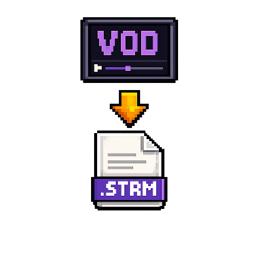

<p align="center">
  
</p>

<h1 align="center">VOD to Media Library</h1>

<p align="center">A Dispatcharr plugin that turns your VOD catalogue into a folder of <code>.strm</code> files (with optional NFO metadata) that media servers — Jellyfin, Emby, Kodi, ChannelsDVR — can index and play.</p>

<p align="center">
  <i>v1.12.0 — slug <code>vod2mlib</code></i>
</p>

> **Plex users:** Plex does *not* play `.strm` files. Jellyfin and ChannelsDVR do. See [Plex compatibility](#plex-compatibility) below.

## Credits

- **Original author:** [shedunraid](https://github.com/shedunraid) — created v0.x–v1.3 ([upstream repo](https://github.com/shedunraid/VOD2MLIB)).
- **Fork maintainer:** [R3XCHRIS](https://github.com/R3XCHRIS) — v1.4+ adds scheduling, bug fixes, and packaging for the [official Dispatcharr Plugins catalogue](https://github.com/Dispatcharr/Plugins). Upstream has been dormant since early 2026; this fork continues maintenance.
- MIT License.

---

## Install

1. **Map a host folder to `/VODS` in your Dispatcharr container** (see [Sharing the VODs folder](#sharing-the-vods-folder-with-media-servers) for *why* this matters and how to share with other apps).

   ```yaml
   # docker-compose.yml
   services:
     dispatcharr:
       volumes:
         - /opt/dispatcharr-vods:/VODS
   ```

2. **Zip the plugin files** (`plugin.py`, `plugin.json`, `__init__.py`, `logo.png`, `LICENSE`, `README.md`, `requirements.txt`). Or grab the prebuilt zip from a [GitHub release](https://github.com/R3XCHRIS/VOD2MLIB/releases).

3. **Dispatcharr → Plugins → Import** → upload the zip → enable the plugin.

Requires Dispatcharr **v0.24.0** or later. The auto-rescan feature additionally needs `django-celery-beat` (Dispatcharr ships with it).

---

## Sharing the VODs folder with media servers

This is the part most people get wrong on first try.

The plugin runs **inside the Dispatcharr container**. When it writes `/VODS/Movies/Aladdin (1992)/Aladdin (1992).strm`, that path exists inside the container's filesystem. For Jellyfin / ChannelsDVR / Kodi to find that file, **the same data has to be visible to them too** — either as a bind-mounted volume on the same host, or via a network share.

**Three common patterns**, pick whichever matches your setup:

### 1. Same host, both apps in Docker (recommended)

Bind-mount the same host directory into both containers. The plugin writes; the media server reads.

```yaml
services:
  dispatcharr:
    volumes:
      - /opt/dispatcharr-vods:/VODS    # plugin writes here

  jellyfin:
    volumes:
      - /opt/dispatcharr-vods:/data/vods:ro    # read-only mount
    # then in Jellyfin: Add Library → Movies → /data/vods/Movies
    #                                  Shows  → /data/vods/Series
```

`:ro` (read-only) is good practice for the consumer — guarantees Jellyfin can't accidentally modify the plugin's output.

### 2. Media server on the same host, *not* in Docker

Just point the media server at the host path directly:

```
/opt/dispatcharr-vods/Movies   # for Movies library
/opt/dispatcharr-vods/Series   # for Series library
```

Watch out for **file permissions** — the Dispatcharr container writes as its own UID (often `1000`/`dispatch`). If your media server runs under a different user, it may not be able to read the `.strm` files. Easiest fix: align UIDs, or `chmod -R a+r /opt/dispatcharr-vods`.

### 3. Media server on a different host

Export the directory over NFS/SMB from the host running Dispatcharr, mount it on the host running the media server.

```bash
# On the Dispatcharr host (Linux + NFS):
echo "/opt/dispatcharr-vods 192.168.1.0/24(ro,sync,no_subtree_check)" >> /etc/exports
sudo exportfs -ra

# On the media server host:
sudo mount -t nfs dispatcharr-host:/opt/dispatcharr-vods /mnt/vods
# ... then point Jellyfin/Plex/Emby at /mnt/vods/{Movies,Series}
```

SMB works equally well; pick whatever your stack already uses.

### One critical setting either way

The `Dispatcharr URL` in plugin settings is **baked into every `.strm` file** — it's the URL the media server's player follows when you press Play. It MUST be reachable from wherever your media server runs:

- Same host: a LAN IP works (e.g. `http://192.168.1.10:9191`).
- Different host on same LAN: still a LAN IP, just make sure routing/firewall allows it.
- Different network: a routable hostname/IP, possibly via Tailscale, VPN, or reverse proxy.

`localhost` / `127.0.0.1` will not work — your media server is a different process, possibly on a different machine. The plugin actively rejects this.

---

## Settings

The Settings tab is grouped into four sections:

| Section | Field | What it does |
|---|---|---|
| **Paths & hosts** | Root Folder for Movies / Series | Paths inside the container (defaults `/VODS/Movies`, `/VODS/Series`) |
|  | Dispatcharr URL | Externally-reachable URL of Dispatcharr (NOT `localhost`). Baked into every `.strm`. |
| **Movies** | Batch Size | How many movies to process per click |
|  | Generate Movie NFO Files | Toggle Kodi/Jellyfin metadata generation |
|  | Nest Movies by Category | Wrap each movie folder inside a subfolder named by its M3U category (off by default; movies without a category go to `Unassigned/`) |
| **Series** | Batch Size (Series) | How many series to process per click |
|  | Generate Series NFO Files | Toggle `tvshow.nfo` and per-episode `.nfo` |
|  | Refresh Existing Series | Re-evaluate already-processed series for new episodes (cron-friendly) |
|  | Nest Series by Category | Wrap each series folder inside a subfolder named by its M3U category (off by default; series without a category go to `Unassigned/`) |
| **Auto-rescan schedule** | Schedule (cron) | Standard 5-field expression. Default `0 3 * * *` (daily 03:00) |
|  | Schedule Timezone | IANA timezone the cron is interpreted in (e.g. `Europe/London`). Empty = UTC. Handles DST automatically. |
|  | Scheduled Action | What the cron fires (full rescan recommended) |

## Workflow

**First run.** Configure paths → click `[LIBRARY] Catalogue snapshot` to verify the plugin can see your VODs → click `[GENERATE] Movies` with Batch Size 10 → spot-check the output → scale up.

**Scaling up.** Increase Batch Size, click again. Existing files are skipped, so each click only processes new ones.

**Auto-rescan.**
1. Turn ON **Refresh Existing Series**.
2. Set **Scheduled Action** to **Full rescan**.
3. Click `[SCHEDULE] Apply / Update`.
4. Verify with `[SCHEDULE] Show status` — last run / total runs populate after the first cron tick.
5. Optional: click `[SCHEDULE] Test fire now` to immediately replay the scheduled action without waiting for the next cron tick.

The cron snapshots your settings at click-time. **Re-click Apply after changing any setting** to refresh the snapshot.

## Plex compatibility

Plex does **not** play `.strm` files (it can index them but the URL inside doesn't play). This is a long-standing Plex limitation — it's been an unfulfilled feature request for 5+ years.

Workable alternatives:

- **Jellyfin alongside Plex.** Jellyfin plays `.strm` natively. Run it in a container next to Plex, point both at the same library folder (see [Sharing the VODs folder](#sharing-the-vods-folder-with-media-servers) above).
- **ChannelsDVR's Personal Media** — works perfectly out of the box. Point CDVR at the Movies/Series root.
- **Kodi** — works.
- **Emby** — works.

## Troubleshooting

**"Unknown action" error in the toast.** Dispatcharr cached an old version of the plugin module. `docker restart dispatcharr` clears it. Toggling enable/disable on the plugin also forces a reload.

**The Run button drops below the action title instead of right-aligning.** That's Dispatcharr's UI flex-wrap when the description spans 2+ lines. We keep descriptions single-line to avoid this; if it happens again, the description is too long for your viewport.

**Cron task registered but didn't fire.** Check `[SCHEDULE] Show status` — `last_run` should populate after the first scheduled tick. If still `never` after the expected time:
- Verify Celery beat is running in your Dispatcharr deployment.
- Check container logs for `core.scheduling Updated periodic task 'vod2mlib.auto_rescan'`.
- Click `[SCHEDULE] Test fire now` to confirm the task itself works (proves it's a scheduling-layer issue, not a plugin issue).

**Schedule fires but no new files appear.** Most likely: `Refresh Existing Series` is OFF and your existing series already have folders, so the cron only adds *new* series. Toggle Refresh Existing ON, click Apply Schedule again to update the snapshot.

**Media server can't see the generated files at all.** The host path isn't shared with the media server's process. See [Sharing the VODs folder](#sharing-the-vods-folder-with-media-servers).

**Media server sees the files but playback fails immediately.** Open one of the `.strm` files in a text editor — it contains a single URL. Try fetching that URL from the machine running your media server (`curl -I <url>`). If that fails, the `Dispatcharr URL` setting isn't reachable from there. Fix the URL, re-run `[GENERATE] Movies` (or `[⚠ DANGER] Clean up Movies` first to wipe the stale URLs).

**"All profiles at capacity" error when playing on TiviMate / Android.** Not a `.strm` issue — this is a known Dispatcharr connection-counting bug ([Dispatcharr #451](https://github.com/Dispatcharr/Dispatcharr/issues/451)). TiviMate (and similar Android players) makes multiple simultaneous Range requests to probe a file before playback; Dispatcharr counts each request as a separate provider connection, blowing through `max_streams=1` before playback even starts. The community plugin [`dispatcharr_vod_fix`](https://github.com/cedric-marcoux/dispatcharr_vod_fix) patches Dispatcharr's request handling to track slots by (client IP + content UUID) so multiple Range requests share one slot. Install it alongside this plugin if your Android clients can't play VOD content.

**Folders named `Aladdin (2026) (2026)` (duplicate year).** This was a bug in v1.4 and earlier. Fixed in v1.5+ but pre-existing duplicate-year folders aren't auto-renamed. Run `[⚠ DANGER] Clean up Movies` once to remove them, then re-run `[GENERATE] Movies` to regenerate cleanly. (Cleanup deletes only `.strm`/`.nfo` — user-added subtitles/posters survive.)

**Generate Series fails for some series.** The summary lists the failed series names with their errors. Common causes: M3U upstream timeout, malformed episode metadata. The plugin continues with the rest of the batch.

**`localhost`/`127.0.0.1` in Dispatcharr URL.** The plugin refuses to write `.strm` with a localhost URL — your media server can't resolve it. Use the container's reachable IP/hostname.

## Development

Pure-helper unit tests live in `tests/`. From the repo root:

```bash
python3 -m pytest tests/ -v
```

The tests don't need Django or a running Dispatcharr — they exercise `_clean_title`, `_strip_trailing_year`, `_sanitize_filename`, `_parse_cron`, `_extract_genres`, `_mask_url`, and the path-building helpers in isolation. 45 tests, ~50ms.

The bundled logo is reproducible — replace `tools/source_logo.png` and run `python3 tools/build_logo.py` to regenerate `logo.png` at 512×512 with NEAREST resampling (preserves pixel-art crispness).

## Architecture (for contributors)

- The plugin is a single `plugin.py` declaring a `Plugin` class with `fields`, `actions`, and `run()` per Dispatcharr's plugin contract.
- `plugin.json` is the manifest the [Dispatcharr/Plugins catalogue](https://github.com/Dispatcharr/Plugins) reads. Dispatcharr's runtime reads action metadata from the Python class — the JSON is for the catalogue and pre-enable preview.
- Schedule registration uses `django-celery-beat`'s `PeriodicTask` + `CrontabSchedule`. The cron-fired task is a module-level `@shared_task` named `vod2mlib.scheduled_rescan` that constructs a fresh `Plugin()` and dispatches.
- Settings are snapshotted into the PeriodicTask's `kwargs` at Apply-time so the cron runs with deterministic config. Re-click Apply to refresh.

## Changelog

**v1.12.0** — New `Schedule Timezone` setting (IANA name like `Europe/London`, `America/New_York`; default empty = UTC). The cron expression is now interpreted in that timezone, so `0 3 * * *` in `Europe/London` fires at 03:00 local time year-round — DST handled automatically. `[SCHEDULE] Show status` now reports the timezone alongside the cron. New `help_url` manifest field pointing at the README — Dispatcharr's plugin tile renders this as a link next to the author name, so users can find the docs without leaving the UI. Validator (`_validate_timezone`) rejects invalid IANA names at Apply time with a helpful error pointing at the timezone list. 7 new unit tests (113 total).

**v1.11.0** — Optional category-nested folder layout. Two new boolean settings (both default OFF): `Nest Movies by Category` and `Nest Series by Category`. When ON, each item's folder is wrapped in a subfolder named by its raw M3U category — useful when your provider organises content by genre. Items without a category land under `Unassigned/`. Items present under multiple categories (e.g. 4K vs HD) get separate folders intentionally. Cleanup actions refactored to walk recursively (`os.walk`) so they handle both flat and nested layouts in one pass — empty Season / series / category folders are removed bottom-up, user-added files (subtitles, posters, extras) are still preserved. **Layout-change warning:** flipping a `Nest by Category` setting after generation does NOT migrate existing folders — the new layout coexists alongside the old. Run `[⚠ DANGER] Clean up Movies` / `Series` followed by `[GENERATE]` to fully switch layouts. 17 new unit tests (106 total).

**v1.10.1** — Year-bucket category names like `2026 Movies` / `1990s Series` / `2026 TV Shows` are no longer emitted as fake genres. These come from IPTV providers that organize their VOD catalogue by year rather than by genre — passing them through to media servers actively confuses genre browsing in Plex/Jellyfin/Kodi. Now: when the only category-derived genre would be a year-bucket, no `<genre>` tag is emitted at all. Plex/Jellyfin/CDVR will fetch real genres from TMDB themselves via the `<tmdbid>` we already emit. Real categorical genres (`Action`, `Drama, Crime`, `Action / Adventure`) pass through unchanged. Mixed cases (`Action / 2026 Movies`) keep the real part and drop the bucket. 13 new unit tests (89 total).

**v1.10.0** — NFO files now emit external IDs and richer metadata, dramatically improving identification by ChannelsDVR / Jellyfin / Plex / Kodi / Emby. `tvshow.nfo` and `episode.nfo` get `<tmdbid>`, `<imdbid>`, and Kodi-style `<uniqueid type="tmdb"|"imdb">` (movie NFO already had IDs; gets `<uniqueid>` now too). Series and episode NFOs additionally get `<rating>`. Episode NFO gets `<aired>` (from `air_date`) and `<runtime>` (from `duration_secs`). Genre selection now prefers Dispatcharr's DB-stored `Series.genre` / `Movie.genre` (TMDB-grade values like "Sci-Fi & Fantasy") over the M3U-category-derived genre (which often produced unhelpful values like "Australian Tv"). Falls back to the category when the DB field is empty. 22 new unit tests (76 total). Existing folders need a regenerate to pick up the richer NFOs — `[⚠ DANGER] Clean up Movies` / `Series` then `[GENERATE]` will refresh them.

**v1.9.4** — Closes a real footgun reported on the Dispatcharr Discord against the legacy v1.3 plugin: a user edited the Dispatcharr URL field but never clicked Save, so every `.strm` file silently shipped the placeholder URL `http://192.168.99.11:9191` and nothing played. Now: the Python class default is empty, the placeholder `http://192.168.99.11:9191` is rejected on action with a clear error, and a fresh installer is forced to set the URL before anything generates. As a separate concession to host-network setups, the localhost reject is downgraded to a warning — a setup with Dispatcharr and the consumer on the same host with shared network namespace can legitimately use `localhost`/`127.0.0.1`. Validation is centralised in `_validate_dispatcharr_url`, with 9 new unit tests (54 total).

**v1.9.3** — Replaced the auto-generated V-on-gradient `logo.png` with custom pixel-art artwork (a CRT showing "VOD" with a download arrow into a `.STRM` file). Source kept at `tools/source_logo.png`; `tools/build_logo.py` resizes to 512×512 with NEAREST resampling.

**v1.9.2** — Display name changed from `VOD2MLIB` to `VOD to Media Library`. Slug, repo URL, install folder name, and Celery task identifiers all unchanged.

**v1.9.1** — Trimmed `[GENERATE] Full rescan` and `[SCHEDULE] Test fire now` descriptions to keep their Run buttons right-aligned.

**v1.9.0** — NFO titles no longer include the year (Kodi/Jellyfin scrapers prefer just the title). Shared language-prefix regex between `_clean_title` and `_extract_genres`. `_generate_movies` now uses `query.iterator()` so the batch limit is honoured even when most candidates are already-done. Magic numbers promoted to class constants. New `[SCHEDULE] Test fire now` action. Failed series names surface in the rescan summary. New `tests/` directory with 45 unit tests.

**v1.8.x** — Section dividers on Settings tab, action labels match the design's renaming map, full-rescan confirm dialog, `[BRACKET]` style headers.

**v1.7.x** — UI clarity: button colors, confirm dialogs in Python class, accurate descriptions, `Rescan all` forces refresh-existing.

**v1.6** — Rescan-friendly: per-episode skip, optional M3U re-fetch, `Refresh Existing Series` toggle. Schedule rescans now actually pick up new episodes.

**v1.5** — Submission-ready: `plugin.json` manifest, MIT/attribution, `__init__.py`. Bug fixes: duplicate-year folders, AC-130 over-strip, batch-limit unreachable for series, episode query at DB level, `checkbox` → `boolean`, scan counts unique not relations. Cleanup is now non-destructive.

**v1.4** — Cron-driven auto-rescan via `django-celery-beat`. New `Rescan All` action.

**v1.3 and earlier** — see [shedunraid's upstream](https://github.com/shedunraid/VOD2MLIB) for the original v0.x–v1.3 history.
